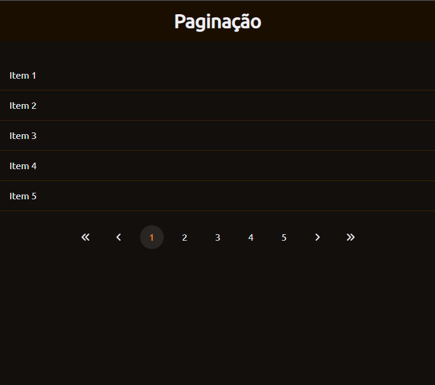

<h1 align="center">
  💻 Desafio Paginação
</h1>

  

  

<h4 align="center"><a href="https://lucasgabriell97.github.io/pagination/">Clique para visitar o projeto</a></h4>

## 📚 Sobre o projeto

O desafio se trata de um cartão de perguntas, totalmente responsivo e com a funcionalidade de exibir e esconder a resposta quando o usuário clicar na pergunta. 
O projeto se trata de uma paginação, trazendo a funcionalidade do usuário clicar nos números ou nas setas para avançar e voltar a página, onde cada página vai trazer uma quantidade de 5 items.

## 💼 Tecnologias utilizadas

- HTML;
- CSS;
- JavaScript;
